# 🏭 SISTEMA METALTECH - FACTORYTRACK

Oii, esse README vai servir de apoio para você que quer fazer esse sistema funcionar certinho.

## 👥 Integrantes

* Fernanda C. Rodrigues Ferreira

* Isabelle Queiroz Rodrigues

* Isabelly Sofia Domingues

* Sarah Kohn Baldoini

---

# 📌 Sobre o Projeto

Nós utilizamos um sistema base fornecido pelo professor, porém fizemos várias alterações para transformar o projeto em um sistema voltado para uma empresa fictícia chamada MetalTech.

A MetalTech é uma empresa que trabalha com produtos metálicos, como chapas, tubos, barras de aço, panelas e kits de talheres.

O sistema recebeu o nome de FactoryTrack e tem como objetivo ajudar no controle de pedidos, clientes, produtos e usuários.

---

# 📂 Estrutura de Pastas

O projeto deve seguir esta hierarquia:

**ESTRUTURA**

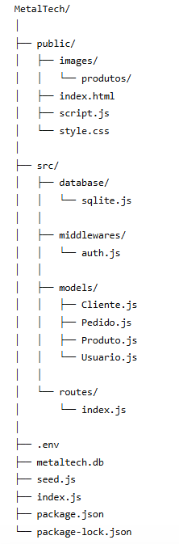

Primeiramente organizamos as pastas seguindo essa estrutura fornecida pelo professor, assim como na imagem acima. Tem arquivos a mais, porém vamos colocar eles mais para frente, continue seguindo o passo a passo.

## 🛠️ Passo a Passo da Organização:

Como precisávamos criar as pastas e colocar tudo no lugar certo, vou explicar com as minhas palavras, caso não tenha entendido pela foto da estrutura.

1. Pasta Raiz: Crie a pasta MetalTech/ ou FactoryTrack/ para guardar todos os arquivos do projeto.

2. Pasta Public: Crie public/ e mova para lá: index.html, script.js, style.css e a pasta images/.

3. Pasta Images: Dentro de public/, crie images/. Dentro dela, coloque as imagens utilizadas no sistema, como banner, ícones e imagens dos produtos.

4. Pasta Produtos: Dentro de public/images/, crie produtos/ e coloque as imagens dos produtos cadastrados, como chapa_lisa.jpg, tubos_inox.jpg, barras_aco.jpg, panelas.png e talher.png.

5. Pasta Src: Crie a pasta src/.

    * Dentro de src/, crie database/ e coloque o arquivo sqlite.js.

    * Dentro de src/, crie middlewares/ e coloque o arquivo auth.js.

    * Dentro de src/, crie models/ e coloque os arquivos: Cliente.js, Pedido.js, Produto.js e Usuario.js.

    * Dentro de src/, crie routes/ e coloque o arquivo index.js.

6. Arquivos Finais: Na raiz do projeto, deixe os arquivos .env, .gitignore, metaltech.db, seed.js, index.js, package.json e package-lock.json.

Prontinho, agora é necessário instalar as dependências do projeto para o sistema funcionar corretamente.

---

# ⚙️ Instalação de Dependências

Como você já tem todos os códigos disponíveis, agora vamos tentar fazer esse sistema rodar.

Primeiro abra a linha de comando do VS Code. Você pode utilizar o atalho Ctrl + " e mudar de PowerShell para Command Prompt se preferir.

Depois digite os seguintes comandos, um de cada vez, no terminal:

1. npm install express

2. npm install sql.js

3. npm install jsonwebtoken

4. npm install bcryptjs

5. npm install cors

6. npm install dotenv

7. npm install nodemon

Ou, se preferir, pode instalar tudo de uma vez com:

npm install

---

# 🚀 Como Rodar o Sistema

Agora que está tudo instalado, volte para o terminal do VS Code para finalmente fazer o servidor rodar.

## 1. Entre na pasta:

cd MetalTech

## 2. Popule o banco de dados:

node seed.js

Esse comando cria os usuários, clientes e produtos iniciais do sistema.

## 3. Inicie o servidor:

node index.js

Quando o servidor iniciar, links aparecerão no terminal. Clique no link do Front-end para abrir o site.

Normalmente aparece assim:

http://localhost:3001

---

# 🔑 Acesso Padrão (Login)

## Administrador

* Usuário: admin@metaltech.com

* Senha: admin123

## Atendente

* Usuário: atendente@metaltech.com

* Senha: atendente123

## Estoque

* Usuário: estoque@metaltech.com

* Senha: estoque123

---

# 📦 Funcionalidades do Sistema

O sistema FactoryTrack possui as seguintes funcionalidades:

* Login com autenticação

* Dashboard com resumo do sistema

* Cadastro de produtos

* Cadastro de clientes

* Cadastro de usuários

* Registro de pedidos

* Listagem de ordens

* Visualização de detalhes dos pedidos

* Filtro por status

* Alteração de status dos pedidos

* Modo claro e escuro

* Imagens nos produtos

* Controle de acesso por tipo de usuário

---

# 🧾 Produtos Cadastrados

Alguns produtos metálicos já vêm pré-cadastrados no sistema para teste:

* Chapa Lisa

* Tubos Inox

* Barras de Aço

* Panelas

* Kit Talher

Esses produtos aparecem no catálogo e podem ser usados na criação dos pedidos.

---

# 🛠️ Tecnologias Utilizadas

## Front-End

* HTML

* CSS

* JavaScript

## Back-End

* Node.js

* Express

## Banco de Dados

* SQLite

* sql.js

## Segurança

* JWT

* bcryptjs

---

# 📸 Prints do Sistema

**TELA DE LOGIN**

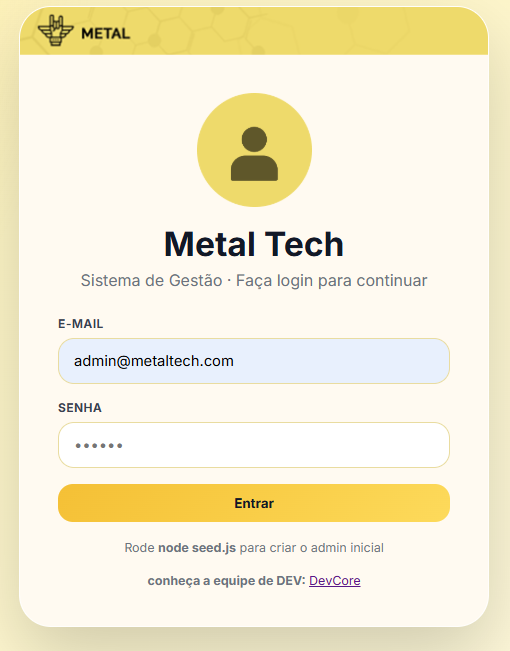

**TELA INICIAL - MODO CLARO**

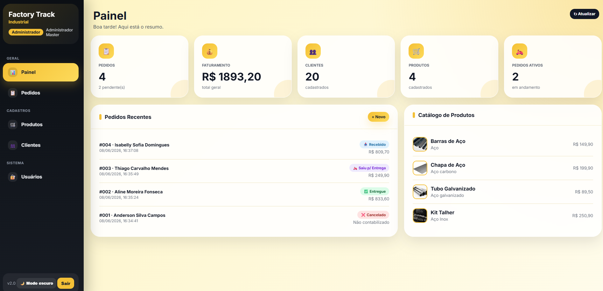

**TELA INICIAL - MODO ESCURO**

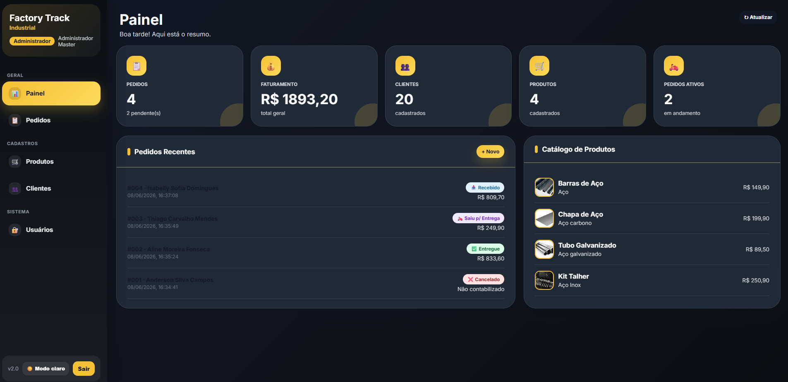

**TELA DOS PEDIDOS - MODO CLARO**

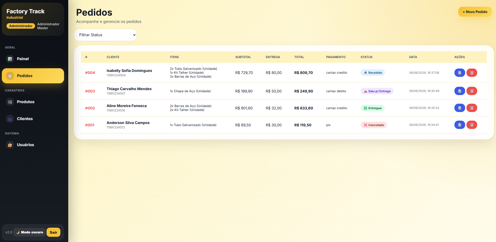

**TELA DOS PEDIDOS - MODO ESCURO**

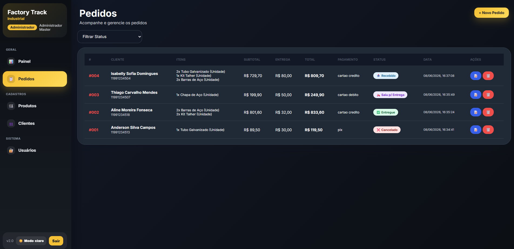

**TELA DOS PRODUTOS - MODO CLARO**

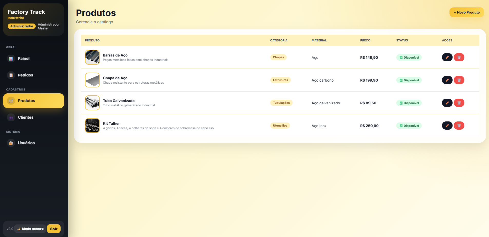

**TELA DOS PRODUTOS - MODO ESCURO**

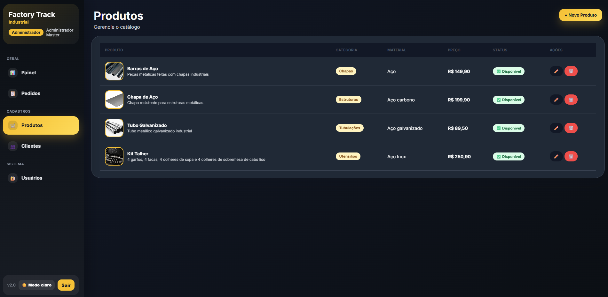

**TELA DOS CLIENTES - MODO CLARO**

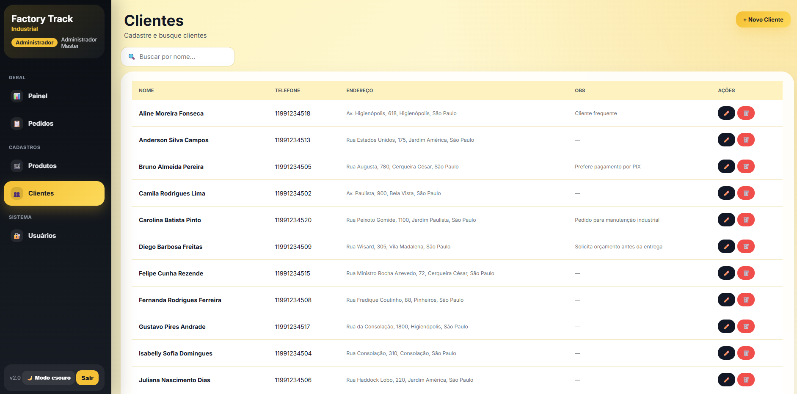

**TELA DOS CLIENTES - MODO ESCURO**

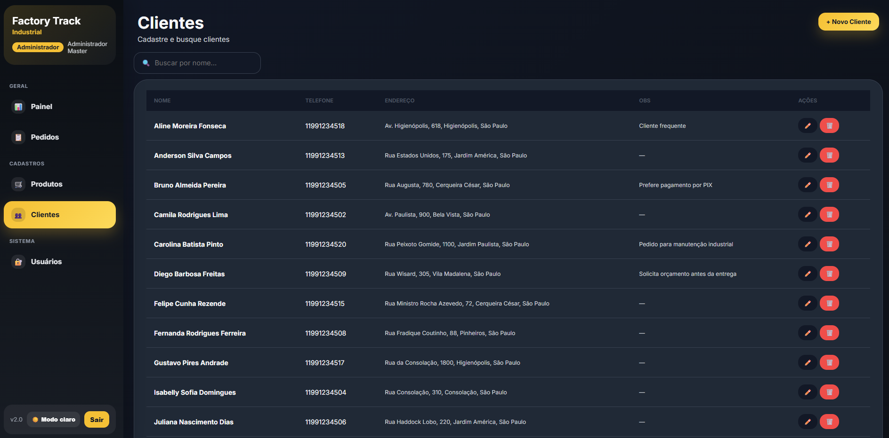

**TELA DOS USUÁRIOS - MODO CLARO**

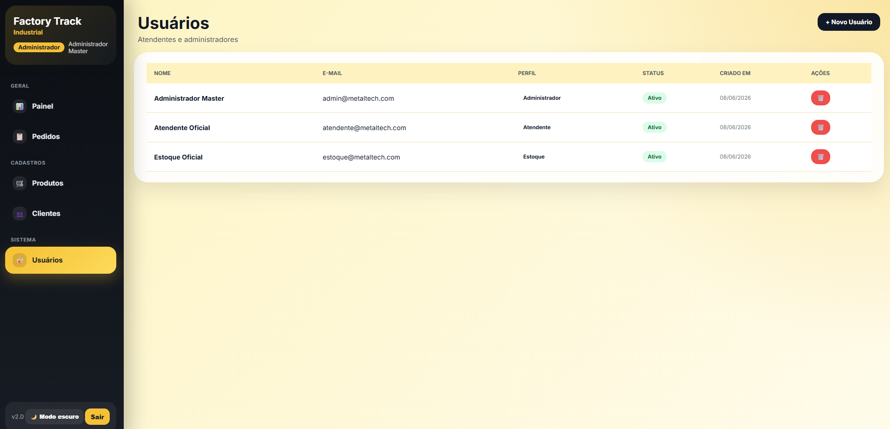

**TELA DOS USUÁRIOS - MODO ESCURO**

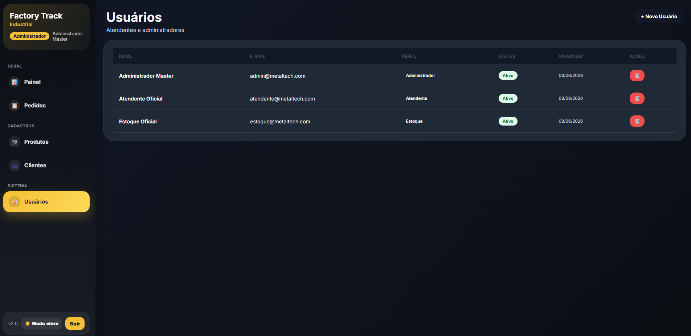

---

# ✅ Conclusão

O sistema FactoryTrack foi desenvolvido para representar uma solução digital para a empresa fictícia MetalTech.

Com ele, é possível organizar clientes, produtos, pedidos e usuários de forma mais prática, além de acompanhar o status das ordens e visualizar informações importantes no painel principal.
